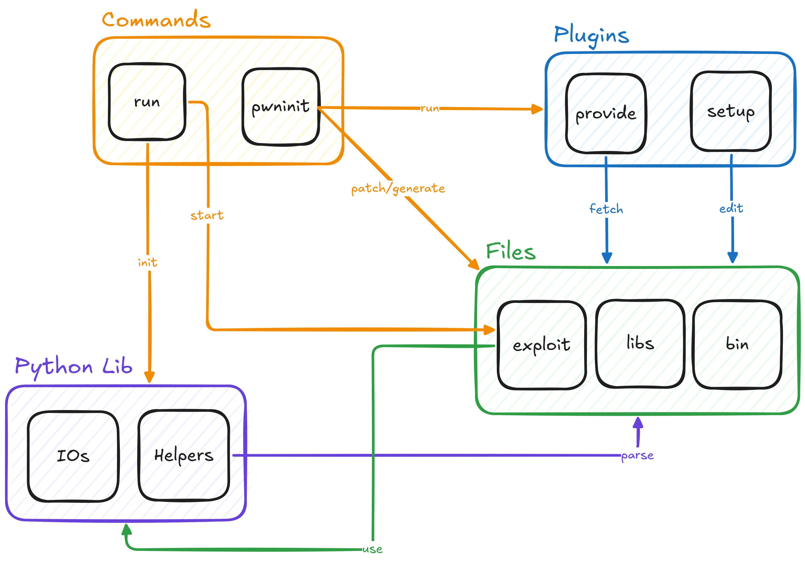

# pwninit

A comprehensive Python toolkit for CTF binary exploitation challenges that streamlines the setup and execution process.

## Features

- **Automated binary analysis** - Automatically detects and categorizes ELF binaries
- **Library management** - Fetches matching libc and linker libraries using libcdb
- **Binary patching** - Automatically patches binaries with correct libc/linker using patchelf
- **Template generation** - Creates exploit templates and documentation stubs
- **Multi-target execution** - Supports local, remote, and SSH execution modes
- **Debugging support** - Integrated GDB debugging with custom commands
- **Provider system** - Extensible system for fetching challenges from various sources (Docker, RootMe, PwnCollege)
- **Utility plugins** - Modular utilities for common exploitation tasks

---

## Installation

### Prerequisites

- Python 3.10+
- patchelf
- GDB (for debugging)
- Docker (for Docker provider)

### Install

```sh
# Install with pipx (recommended)
pipx install pwninit.py
```

---

## Usage

### CLI

Check [CLI - Introduction](/cli/intro/) for an introduction on the commands provided.

### Exploit Development

Check [Pwninit](/pwninit) for the full library API or [Exploitation Development](http://localhost:8000/cli/intro/#exploits) to learn how to create exploit usable with [run](/cli/intro#run-exploit-execution).

#### Example

```py
from pwninit import *

Config(
    binary="./chall",
    libc="./libc.so.6",
    ld="./ld-linux-x86-64.so.2"
)

def exploit(ctx: PwnContext, ioctx: IOContext):
    exe = ctx.elf
    libc = ctx.libc

    # Example usage:
    # sl(ret2win("win"))     # Generate a ret2win payload and send it
    # itrv()                 # Go into interactive mode

    success("All good!")
    itrv()
```

---

## Architecture

### Core Components

| Module       | Description                                                                                                           |
| ------------ | --------------------------------------------------------------------------------------------------------------------- |
| `pwninit.py` | Main CLI entry point for the `pwninit` command. Handles binary analysis, library management, and template generation. |
| `run.py`     | CLI entry point for the `run` command. Manages local, remote, and debug execution modes.                              |
| `config.py`  | Centralized configuration management for binary paths, libc, and provider settings.                                   |
| `context.py` | Definition of global singleton instances used in exploit development.                                                 |
| `io.py`      | I/O abstraction layer for local, remote (netcat/SSH), and debug (GDB) connections.                                    |
| `kernel.py`  | Kernel-specific utilities for kernel exploitation challenges.                                                         |
| `farm.py`    | Challenge fetching and management from various providers.                                                             |

### Helper Modules

| Module                  | Description                                                                                     |
| ----------------------- | ----------------------------------------------------------------------------------------------- |
| `helpers/pwncontext.py` | Defines the `PwnContext` class, which encapsulates the binary, libc, and execution environment. |
| `helpers/utils.py`      | Utility functions for binary analysis, patching, and exploit development.                       |
| `helpers/constants.py`  | Global constants and default values.                                                            |

### Plugin System

| Plugin                  | Description                                                                          |
| ----------------------- | ------------------------------------------------------------------------------------ |
| `plugins/__init__.py`   | Base plugin interface and plugin manager.                                            |
| `plugins/docker.py`     | Docker provider for fetching binaries and libraries from Docker containers.          |
| `plugins/rootme.py`     | RootMe provider for fetching challenges from [RootMe](https://www.root-me.org/).     |
| `plugins/pwncollege.py` | PwnCollege provider for fetching challenges from [PwnCollege](https://pwn.college/). |

### Templates

| Template     | Purpose                                   |
| ------------ | ----------------------------------------- |
| `exploit.py` | Python exploit starter template.          |
| `exploit.c`  | C exploit starter template.               |
| `notes.md`   | Challenge notes template.                 |
| `Makefile`   | Build automation for exploit development. |

### Architecture Diagram



---

## License

`pwninit` is licensed under the **GNU General Public License v3.0** (GPLv3). See the [LICENCE](https://github.com/Super-Botman/pwninit.py/blob/main/LICENCE) file for details.

---

## Support

- **Documentation**: [pwninit.0xb0tm4n.org](https://pwninit.0xb0tm4n.org/pwninit)
- **GitHub**: [Super-Botman/pwninit.py](https://github.com/Super-Botman/pwninit.py)
- **Issues**: [GitHub Issues](https://github.com/Super-Botman/pwninit.py/issues)

---

## Roadmap

- **CTFd Provider**: Add support for fetching challenges from CTFd platforms.
- **Tests**: Expand test coverage for core functionality and plugins.
- **More Templates**: Add templates for additional exploit types (e.g., heap, format string).
